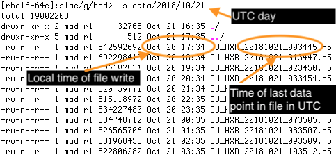

<!DOCTYPE html>
<html lang="en">
<head>
<title>Beam Synchronous Data User Guide</title>
<link rel="stylesheet" type="text/css" href="https://www.slac.stanford.edu/grp/ad/css/base_cardinal.css">
<link rel="stylesheet" type="text/css" href="https://www.slac.stanford.edu/grp/ad/css/addocs.css">

</head> 
<body>

<!--
Modifying this file:
  bsd.html is generated from bsd.md (marksdown). You will need the
  python module named "markdown" installed in your python environment.
  The markdown module can be intalled through pip (or pip3) for
  python3. pip3 is shipped in mac os at the time of writing.
  You'll also need git. git is also shipped with Mac OS at the time of writing.

  bsd.md and bsd.html are in the matlab.git repo in
  /afs/slac/g/cd/swe/git/repos/sites/www.slac.stanford.edu/grp/ad/docs/model/matlab.git

Follow these steps to edit:

git clone yourusername@rhel6-64.slac.stanford.edu:/afs/slac/g/cd/swe/git/repos/sites/www.slac.stanford.edu/grp/ad/docs/model/matlab.git

  Edit bsd.md
  Convert bsd.md to bsd.html:
         python -m markdown -x markdown.extensions.toc -x markdown.extensions.tables bsd.md > bsd.html
  git commit -m "comment" bsd.{md,html}
  git push
  Verify it worked by visiting https://www.slac.stanford.edu/grp/ad/docs/matlab/documents/bsd.html
Authors: Greg White, Oct 22, 2018, SLAC, of work of Michael Davidsaver, Greg White.
-->

<!-- The Masthead -->

    

 

 

LCLS BEAM SYNCHRONOUS DATASTORE USER GUIDE

Greg White, Michael Davidsaver, SLAC, October 2018.  
Revision 1.1, 19-Dec-2018, Added System Management.

 
<!-- End Masthead -->

This document helps people wishing to do offline "big data" analysis of the <a href="https://lcls.slac.stanford.edu" >Linac Coherent Light Source</a> (LCLS) accelerator systems, to access and interpret data files of pulse-synchronous values of diagnostic device measurements of the accelerator, such as Beam Position Monitor data. 

The data files described here, capture all of the data from all measurement diagnostic devices in LCLS, for every pulse. That is, _all the pulse data, all the time_. 

TABLE OF CONTENTS

[TOC]

BEAM SYNCHRONOUS DATA FILES USER GUIDE
======================================

This section describes the pulse synchronous data files of LCLS, for physicists and others wishing to get the files and analyse the data.

Primarily, the data is composed of Beam Position Monitor data (BPM), Klystron data, 300 other assorted pulse synchronous signals, plus some beam "meta-data", such as charge on the cathode, measured electron energy, recorded photon energy, etc.

Data Files' Location
--------------------

The data files are located at:

    /nfs/slac/g/bsd/data/

Many computers at SLAC should also be able to access the files through their GPFS mount point (which should be faster):

    /gpfs/slac/staas/fs1/g/bsd/data/

The two file locations above access the identically same files.

Data files from 11-Mar-2021 and after are located at:

    /nfs/slac/g/bsd/BSAService/data/

The files are arranged in a directory structure reflecting year, ordinal month, ordinal day of capture. 

Note also, that for some days prior to deployment of this system, an _emergency_ stop-gap system that periodically wrote out all the data from the BSA buffers, was deployed (thanks to quick work by Mike Zelazny). The data of that prior system is still available at time of writing, at: `/nfs/slac/g/bsd/faultbuffer/`.

Timestamps
----------

Coordinated Universal Time (UTC) (basically Greenwich Mean Time - GMT) is used throughout the system (or as engineers call it, POSIX time). Consequently:

* The day/ directory will be the day as of UTC - 7 hours ahead of Pacific Time (PT). So, when we're in PST, to find the files of the first 7 hours of our local SLAC day, the data files will be in the directory of the next day. 

* The data files are named with the UTC datestamp of the END of their data taking period

* The data in the files, is timestamped in "seconds past epoch" (and nanoseconds past that second), past midnight on January 1st, 1970, UTC. See [Data Description](#data-description)

* Hence, the data timestamps match the file names match the directory structure.

Data Description
----------------

The files contain data in periods of 60 minutes, or 1.5 GB, whichever comes first. Typically the files are 60 minutes and 1.2 GigaBytes. It should be that no data pulse is missed between files.  

The data files are HDF5 Matlab v6 compatible, named '.h5'. Each file contains ALL the beam synchronous PVs (N), for all beam pulses (M) for the period of the acquisition cycle. That is, a file constitutes a logical table about ~120 * 60 * 60 pulses rows x ~1200 PVs columns.

Each beam synchronous PV is one HDF5 Dataset within the h5 file. Two extra datasets supply the timestamp of the data in sufficient precision to identify a single pulse; "secondsPastEpoch" and "nanoseconds".  Hence the timing system's PID is not explicitly recorded.

The `secondsPastEpoch` is integer seconds since the same time base as POSIX time, midnight on 1st January 1970 in Greenwich.

`nanoseconds` is whole nanoseconds past its same row `secondsPastEpoch`.
   
See [Matlab help below](#matlab-examples) for how to easily convert these timestamps to human readable local time.

Some data files may be smaller than the "modal" size; that is expected when the beam rate drops, since the data is only collected on timing beam events.

Accessing the Data Files
--------------------

`/nfs/slac/g/bsd/data/` should be available on all SLAC Public interactive computers. Some hosts can also see the files at the faster fileserver `/gpfs/slac/staas/fs1/g/bsd/data/`, see below:

1. `rhel6-64.slac.stanford.edu` - SLAC's primary computer cluster for interactive analysis. OS is Linux red-hat 6. The /gpfs/slac/staas path is available
2. `centos7.slac.stanford.edu` - another computer cluster for interactive analysis. OS is Linux Centos 7. The /gpfs/slac/staas path is available
3. [LSF (Load Sharing Facility)](https://confluence.slac.stanford.edu/display/SCSPub/High+Performance+Computing+at+SLAC) - SLAC's High Performance Computing batch compute system. The "bullet" cluster (bsub -R bullet) can access `/gpfs/slac/staas/fs1/g/bsd/data/` and other clusters are being added. Avoid `/nfs/slac/g/bsd`, it is not mounted at time of writing
4. [`jupyter.slac.stanford.edu`](https://jupyter.slac.stanford.edu) - SLAC's python web based notebook facility. The Machine Learning images (as selected from the Spawner) have been tested and can see the GPFS mount point, `/gpfs/slac/staas/fs1/g/bsd/data/`. Avoid the NFS mount point as it has automount issues. 

Copying the data files to your own computer
-------------------------------------------

The following are examples of getting the pulse data files from `/gpfs/slac/staas/fs1/g/bsd/data/`
or `/nfs...` to a personal Apple Mac computer (OS X) (or other unix based machine). The tools used are Secure Shell (ssh) and Secure Copy Program (scp), which is usually come with Mac OS X. Type lines like the following into a Terminal window: 

To get a remote directory listing:

    % ssh -x -l <yourusername> rhel6-64.slac.stanford.edu ls /nfs/slac/g/bsd/data/2018/10/22
    total 19081952
    drwxr-xr-x 2 mad rl     32768 Oct 22 16:35 ./
    drwxr-xr-x 6 mad rl       512 Oct 22 17:35 ../
    -rw-r--r-- 1 mad rl 840476543 Oct 21 17:35 CU_HXR_20181022_003549.h5
    -rw-r--r-- 1 mad rl 845860287 Oct 21 18:35 CU_HXR_20181022_013553.h5
    -rw-r--r-- 1 mad rl 841526072 Oct 21 19:35 CU_HXR_20181022_023555.h5
    ...

To get files one at a time, you can use the _scp_ command (optionally with compression, -C). The following is an example of getting 2 data files:

    % scp -C <yourusername>@rhel6-64.slac.stanford.edu:/nfs/slac/g/bsd/data/2018/10/22/CU_HXR_20181022_003549.h5 .
    % scp -C <youruseramee>@rhel6-64.slac.stanford.edu:/nfs/slac/g/bsd/data/2018/10/22/CU_HXR_20181022_013553.h5 .

The files loaded over eurodam wifi have download speed between 1.2MB/s - 8.5 MB/s, ie 2.5 - 15
minutes per file roughly, depending on wifi load.

One could get multiple files at time, or whole directories. For such operations, see `scp -r` and the `rsync` command.

Data validation and veracity
----------------------------

Data collection of BSA data started with this system on 19-Oct-2018.

In general, the system does an excellent job of recording every pulse, including at file boundaries. Note that there are a few gaps in the data though, such as times when we run at 0 rate, and at system commissioning we stopped and restarted a few times. We have left these data files in the collection. 

As this project is deployed and improved, we add PVs and iron out system issues of the new technology being used. This log shows which PVs you can expect to be missing (or should we discover any to be wrong - none so far) in the early data sets recorded.

| Time Period | Issue and followup |
| ----------- | ------------------ |
| 19-Oct-18 to ~ 17:00 22-Oct-18 PST | No PVs of TSE -1 were included. In practice this meant only BPMS and BLD data were included over that first weekend | Fixed Monday 22nd Oct 18 |
| 23-Oct-18 17:35 to 24-Oct-18 11:28 | Gap in data recording due to unrelated process filling tmp disk space on intermediate host |
| 22-Oct-18 to time of writing | Every signal that has no deadband, that is MDEL == 0, will have many values == NaN. That is, all data points  where the PV doesn't change value, will have NaN after the time of data change, for all timestamped entries, until the time of next data change. Eg PICS in BSY. We expect to fix this by "backfill" very soon. |
| 22-Oct-18 to time of writing | No PV that updates > 120 Hz, eg Beam Loss Monitors. This will be fixed shortly.|

MATLAB EXAMPLES
===============

Simply load all pulse data from pulse synchronous data h5 file as simple collection of array values, each named after a PV:

    >> load('~/Development/bsd/CU_HXR_20181022_003549.h5','-mat');

The load may take a few minutes!

To see which pulse synchronous process variables' data you have, simply use Matlab `who`

    >> who

Data timestamps and local time in Matlab
----------------------------------------

Having loaded the data, convert seconds and nanoseconds past UTC base time (aka POSIX time), to local time:

    >> ts=double(secondsPastEpoch)+double(nanoseconds)*1e-9; % Make vector of real seconds POSIX time
    >> t=datetime(ts,'ConvertFrom','posixtime','TimeZone','America/Los_Angeles'); % Make vector of local times

Plot 1 PV data against local time (having loaded all above, and converted to local time per above): 

    >> plot(t,BPMS_IN20_525_X); % Plot value against local time

Prior to loading the data of a file, you can make a quick check the time range covered by a dataset file, without loading the whole file, by examining first and last value of the secondsPastEpoch variable within it.

    >> tssecs=h5read('~/Development/bsd/CU_HXR_20181022_003549.h5','/secondsPastEpoch');
    >> datetime([tssecs(1);tssecs(end)],'ConvertFrom','posixtime','TimeZone','America/Los_Angeles')

    ans = 

      2x1 datetime array

        21-Oct-2018 16:35:47
        21-Oct-2018 17:35:49

hdf5 metadata and targeted data access
---------------------------------------

Examine which PVs data are in the h5 data file, using `h5info`:

    >> info=h5info('~/Development/bsd/CU_HXR_20181022_013553.h5');
    >> PVnames={info.Datasets.Name}

Load just one PV variable's data from h5 data file, using `h5read`:

    >> bpms_ltu1_910_y=h5read('~/Development/bsd/CU_HXR_20181022_013553.h5','/BPMS_LTU1_910_Y');

Beam Data as a Matlab Table
---------------------------
Load all data from h5 file as matlab "Table" (Matlab 2016 and above):

    >> d0=struct2table(load('~/Development/bsd/CU_HXR_20181022_003549.h5','-mat'));

Having loaded as a Matlab Table, examine which Variables you have in the table:

    >> d0.Properties.VariableNames

Look at the data of 1 variable

    >> d0.BPMS_UND1_3395_X

SYSTEM MANAGEMENT
=================

The Storage As a Service (STAAS) system of OCIO is used as the filesystem management technology.
Contact unix-admin@slac.stanford.edu, Lance Nakata @ SLAC, or Yemi Adesanya @ SLAC.

That nfs directory is in the 'bsd' NFS group.

    /usr/local/bin/ypgroup examine -group bsd      to examine members

The files are presently in the `rl` group, user `mad`, but are world readable. Shortly they will change to bsd group.

Basic Architecture
------------------

The Synchronous Data Service is in fact composed of 2 servers;

First, the 'Collector' runs on the controls network, presently lcls-srv04. It collects the data of beam synchronous PVs given to it in a configuration list, and "event builds" them into consistent rows of data. It's an EPICS 7 service, implemented in python.

The collector publishes several EPICS 7 PVs. _You MUST execute the following additional EPICS 7 setup line before using these 3 pvAccess PVS:_

     export EPICS_PVA_AUTO_ADDR_LIST=TRUE

     # monitor live status updates
     pvget -m RX:STS

     # see current signal list
     eget -T RX:SIG

     # view live data - an EPICS 7 Table, very large, since it's many pulse synchronous
     # PVs/columns signals wide by many measured pulses rows. May be useful for bye-eye check on 
     # a signal of interest with a filter like grep, eg:
     pvget RX:TBL | grep TCAV_LI24_800_A 

Second, the 'Writer' runs on the DMZ network. It listens to the EPICS 7 events from the Collector, and writes HDF5 (.h5) files to `/tmp/`. Periodically, it copies those files over to the public data area, presently `/nfs/slac/g/bsd/`.

To Add a Signal
---------------
Presently, the nominal way to add a signal to the list, is to pvput RX:SIG with the new list (yes, even to add just 1).

Verify signal name:

     eget -s ds -a name GJET:LTU1:927:MULT:QDCRAW

Verify the HW timestamp source type, e.g.:

     caget GJET:LTU1:927:MULT:QDCRAW.TSE
     -1 = timestamp does not come from just the record. At SLAC it means "best time". That is, probably the EVR. 
     -2 = provided by the driver
      0 = processing time, pure sw timestamp, almost certainly not pulse synchronous. 

So, at SLAC, preferably it's -2. -1 is probably ok but talk to engineer. 

To add signal:

* First, setup: `~/mdavidsaver]$ source setup.sh`  (this may change at any time without notice)

* Easiest way (and keeps documented), add your new PV name, by hand edit, to the file of signals, `~/mdavidsaver/signals.txt`

* The cat the signals file and pipe to pvput of the PV. Don't forget the dummy value length designator, in the following case 'X':

     $ cat signals.txt | xargs pvput RX:SIG X

Within 30s of your adding a new PV, a new data file should appear in `mccas0:/nfs/slac/g/bsd/` - in
the appropriate day. However, remember that is the last file with the OLD signal list, since
changing the signal list flushes the file writer. The next file after that first flush will be the one with your new signal.

To verify acquisitions now include your new one: `pvget RX:STS | grep GJET`.

     GJET:LTU1:927:MULT:QDCRAW,      true,    112,  13664,       0,      0,      0

See column names of table:

     PvName
     Connected state (true hopefully)
     Event rate [updates / second] (e.g. 112). Less than 120 when IOCs dead-end filter was applied. But that’s ok because BSD server backfills.
     Wire load including overhead estimated worst case [bytes/sec] 13664
     Num errors: disconnects, internal program errors, overflows. 
 
To remove a signal - as above for addition. Just pvput a new signal list.

Collector Process
-----------------

Check process is running on host:

    ssh -l physics lcls-srv04
    $ [physics@lcls-srv04 ~/greg]$ screen -ls
    There is a screen on:
        4501.bsas       (Detached)                 <— BSD process
        1 Socket in /var/run/screen/S-physics.

Start/restart process:
[talk to Michael], or on lcls-srv04:

    cd ~/mdavidsaver
    source setup.sh
    cd ~/mdavidsaver/bsa/bsas/iocBoot/ioctest/
    ./rx2.cmd

FileWriter Process
------------------

Check process is running on host:

    ssh mccas0
    $ cd /u/rl/mad
    $ source setup.sh
    $ source p4pdev/bin/activate
    $ pgrep -U mad -lf
 
    6197 python h5tablewriter.py lcls-srv04.conf
    13277 SCREEN -S bsas

To restart it, FIRST kill the old one. Best way is login as Michael (mad), attatch to screen session
and stop. Without Michael's login, you need an admin.

    cd bsa/bsas/python
    python h5tablewriter.py lcls-srv04.conf

<address>Greg White, SLAC</address>
<!-- hhmts start -->Last modified: Mon Dec 30 19:02:09 PST 2019 <!-- hhmts end -->

</body>
</html>
